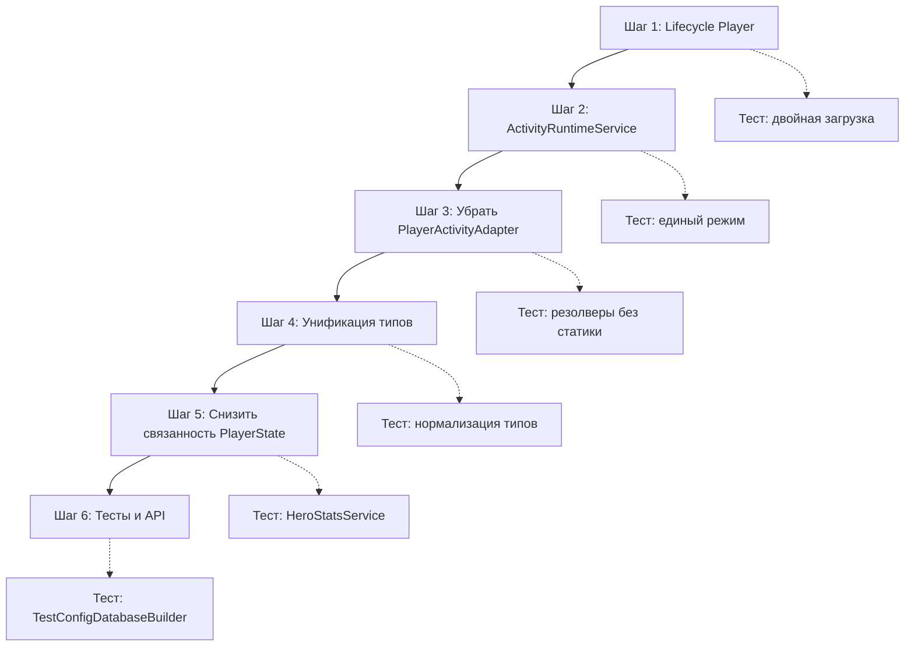

# План рефакторинга: Снизить связанность Configs / Player / Activities

**Issue:** [#18 — [Техдолг] Снизить связанность Configs / Player / Activities](https://github.com/LowPolyMan89/GuildIdle/issues/18)

## Текущая архитектура (проблемы)

### 1. Lifecycle Player — двойная загрузка PlayerState

В [`Player.Bootstrap()`](Assets/Scripts/Player/Player.cs:13):
- Подписка `OnLoaded += LoadAfterConfigs` (строка 16)
- И `WaitUntilLoaded(LoadAfterConfigs)` (строка 23)
- При первой загрузке конфигов `LoadAfterConfigs` вызывается дважды: один раз через `OnLoaded`, второй раз через `WaitUntilLoaded` (который тоже подписывается на `OnLoaded`)

### 2. ActivityRuntimeService — два режима работы

В [`ActivityRuntimeService`](Assets/Scripts/Activities/ActivityRuntimeService.cs):
- Конструктор без параметров (строка 18): использует `PlayerActivityAdapter` → статический `Player`
- Конструктор с `PlayerState` (строка 23): использует `PlayerStateActivityAdapter`
- Методы `GetExecutions()`, `GetExecution()`, `AddExecution()`, `UpdateExecution()`, `RemoveExecution()`, `Save()` (строки 445-476) выбирают реализацию через `_state != null`

### 3. PlayerActivityAdapter — прямая зависимость от статического Player

В [`ActivityPlayerState.cs`](Assets/Scripts/Activities/ActivityPlayerState.cs:66):
- `PlayerActivityAdapter` напрямую вызывает `global::GuildIdle.Player.Player.*` (строки 68-90)
- Это создаёт неявную зависимость Activities → Player

### 4. Взаимная зависимость PlayerState ↔ Activities

- [`PlayerState`](Assets/Scripts/Player/PlayerState.cs:3) импортирует `GuildIdle.Activities` (для `ActivityExecutionSaveData`)
- Activities импортирует `GuildIdle.Player` (через адаптеры и `ActivityRuntimeService`)
- Циклическая зависимость на уровне namespace внутри одной сборки

### 5. Строковые типы —不一致ное сравнение

- **Runtime** (ActivityRequirementResolver, ActivityRewardResolver, LootResolver): использует `StringComparison.OrdinalIgnoreCase`
- **Cross-validator** ([`ConfigCrossConfigValidator.cs`](Assets/Scripts/Editor/ConfigDownloader/ConfigCrossConfigValidator.cs:1082)): использует регистрозависимый `switch` (case-sensitive)
- Пример: `req_type = "SkillLevel"` в cross-validator vs `"SkillLevel"` с `OrdinalIgnoreCase` в runtime

### 6. Дублирование тестовых ConfigDatabase

- Каждый набор тестов создаёт свой `ConfigDatabase` через `CreateDatabase()`
- Нет общего builder/factory

---

## План рефакторинга (6 шагов)

### Шаг 1: Исправить lifecycle Player

**Проблема:** Двойная загрузка PlayerState.

**Решение:**
1. Убрать `WaitUntilLoaded(LoadAfterConfigs)` из `Bootstrap()` — оставить только подписку на `OnLoaded`
2. `Bootstrap()` должен проверять: если `Configs.IsLoaded` — вызвать `Load()` напрямую
3. Если конфиги ещё не загружены — подписаться на `OnLoaded` (один раз)
4. `WaitUntilLoaded` не нужен, т.к. `OnLoaded` уже подписан

**Изменяемые файлы:**
- `Assets/Scripts/Player/Player.cs` — `Bootstrap()`, `LoadAfterConfigs()`, `HandleConfigLoadFailed()`

**Тесты:**
- Добавить тест: `PlayerState_LoadsExactlyOnce_OnConfigLoad`
- Проверить поведение после `Configs.Reload()` (сброс `_state = null`, повторная загрузка)

**Риски:**
- Существующие сохранения не должны потеряться
- `EnsureLoaded()` (строка 261) уже имеет fallback-логику — её нужно проверить на совместимость

---

### Шаг 2: Упростить ActivityRuntimeService — убрать два режима работы

**Проблема:** `ActivityRuntimeService` имеет два режима (через `PlayerState` и через статический `Player`).

**Решение:**
1. Сделать `PlayerState` обязательным параметром конструктора
2. Убрать конструктор без параметров
3. Убрать все проверки `_state != null` в методах `GetExecutions()`, `GetExecution()`, `AddExecution()`, `UpdateExecution()`, `RemoveExecution()`, `Save()`
4. Все execution-методы делегировать напрямую в `_state`
5. `Save()` — принимать `ISaveStorage` опционально, но `PlayerState` обязателен

**Изменяемые файлы:**
- `Assets/Scripts/Activities/ActivityRuntimeService.cs` — конструкторы, execution-методы, Save
- Все места, где создаётся `new ActivityRuntimeService()` без параметров

**Тесты:**
- Обновить существующие тесты, передавать `PlayerState` явно
- Проверить, что `Tick()`, `Start()`, `Complete()`, `Cancel()` работают через переданный `PlayerState`

**Риски:**
- Нужно найти все места создания `ActivityRuntimeService()` без параметров (возможно, в UI-слое или презентерах)

---

### Шаг 3: Убрать прямую зависимость Activities от Player

**Проблема:** `PlayerActivityAdapter` обращается к статическому `Player`.

**Решение:**
1. Удалить `PlayerActivityAdapter`
2. `IActivityPlayerState` остаётся как интерфейс
3. `PlayerStateActivityAdapter` остаётся как единственная реализация
4. `ActivityResolverUtilities.DefaultState()` — убрать или переделать на получение `PlayerState` через параметр
5. Все публичные методы `ActivityResolver`, `ActivityRewardResolver`, `ActivityRequirementResolver`, `ActivityCostResolver`, `LootResolver`, `ActiveHeroLimitResolver`, которые принимают `IActivityPlayerState`, остаются
6. Удалить `[Obsolete]`-перегрузки, которые не принимают `ActivityExecutionContext`

**Изменяемые файлы:**
- `Assets/Scripts/Activities/ActivityPlayerState.cs` — удалить `PlayerActivityAdapter`
- `Assets/Scripts/Activities/ActivityResolverUtilities.cs` — убрать `DefaultState()`
- `Assets/Scripts/Activities/ActivityResolver.cs` — удалить `[Obsolete]`-перегрузки
- `Assets/Scripts/Activities/ActivityRewardResolver.cs` — удалить `[Obsolete]`-перегрузки
- `Assets/Scripts/Activities/ActivityCostResolver.cs` — удалить `[Obsolete]`-перегрузки
- `Assets/Scripts/Activities/ActivityRequirementResolver.cs` — убрать перегрузки без контекста

**Тесты:**
- Обновить тесты, передавать `PlayerStateActivityAdapter` явно
- Проверить, что все резолверы работают через `IActivityPlayerState`

**Риски:**
- Могут быть места в UI/презентерах, которые используют `ActivityResolver.CanStart(activityId)` без контекста

---

### Шаг 4: Унифицировать парсинг runtime-типов

**Проблема:** Cross-validator использует case-sensitive `switch`, runtime использует `OrdinalIgnoreCase`.

**Решение:**
1. Создать статические классы-константы для всех типов:
   - `RequirementType` (SkillLevel, LocationUnlocked, BuildingLevel, ItemCount, Item, Currency, ActivityCompleted, HeroAvailable, ItemEquipped)
   - `RewardType` (Resource, Item, Equipment, Consumable, Recipe, SkillExp, Currency, Gold)
   - `DropType` (Resource, Item, Equipment, Consumable, Recipe, Currency, Gold)
   - `TriggerType` (ActivityCompleted, BuildingLevel, HeroAvailable, LocationUnlocked, ItemCount)
   - `GrantMoment` (OnStart, OnCycle, OnComplete, OnFirstComplete)
2. Заменить `string.Equals(type, "SkillLevel", StringComparison.OrdinalIgnoreCase)` на `string.Equals(type, RequirementType.SkillLevel, StringComparison.OrdinalIgnoreCase)` — или использовать `RequirementType.Matches(type)` хелпер
3. В cross-validator заменить `switch (row.Get("req_type"))` на `switch (row.Get("req_type"))` с использованием тех же констант, но с учётом регистра (или нормализовать регистр перед switch)
4. Либо: нормализовать регистр при парсинге конфигов (привести к одному регистру), тогда и runtime, и validator будут работать одинаково

**Рекомендуемый подход:** Нормализация при парсинге (в `ActivityConfigsParser` и `LootConfigsParser`). Это безопаснее, т.к.:
- Не требует изменения всех switch/case в cross-validator
- Гарантирует единый формат в runtime JSON
- Меньше шансов на расхождение

**Изменяемые файлы:**
- Создать: `Assets/Scripts/Activities/ActivityTypeConstants.cs` (константы типов)
- `Assets/Scripts/Editor/ConfigDownloader/ActivityConfigsParser.cs` — нормализация req_type, reward_type, trigger_type, grant_moment
- `Assets/Scripts/Editor/ConfigDownloader/LootConfigsParser.cs` — нормализация drop_type
- `Assets/Scripts/Activities/ActivityRequirementResolver.cs` — использовать константы
- `Assets/Scripts/Activities/ActivityRewardResolver.cs` — использовать константы
- `Assets/Scripts/Activities/LootResolver.cs` — использовать константы
- `Assets/Scripts/Activities/ActivityResolverUtilities.cs` — `MomentMatches()`, `IsAnyItemType()` использовать константы

**Тесты:**
- Парсер-тесты: проверить, что типы нормализуются
- Runtime-тесты: проверить, что резолверы работают с нормализованными типами

---

### Шаг 5: Снизить связанность PlayerState

**Проблема:** `PlayerState` — монолитный класс, содержит логику расчётов, bootstrap, работу с execution-ами.

**Решение (поэтапно, без полного переписывания):**
1. Вынести расчёты характеристик/усталости героя в отдельный сервис `HeroStatsService`
2. Вынести создание стартового состояния в `PlayerStateFactory` (из `CreateDefault()` и `ApplyDefaultBootstrap()`)
3. Вынести execution-методы в `ActivityExecutionStore` (или оставить в `PlayerState`, но через интерфейс `IActivityExecutionStore`)
4. `PlayerState` остаётся как единый класс состояния, но делегирует специализированные операции сервисам

**Изменяемые файлы:**
- Создать: `Assets/Scripts/Player/HeroStatsService.cs`
- Создать: `Assets/Scripts/Player/PlayerStateFactory.cs`
- `Assets/Scripts/Player/PlayerState.cs` — рефакторинг: вынести bootstrap и расчёты
- `Assets/Scripts/Player/Player.cs` — использовать новые сервисы

**Тесты:**
- Перенести тесты bootstrap в `PlayerStateFactoryTests`
- Добавить тесты `HeroStatsService`

**Риски:**
- Этот шаг самый объёмный, его можно отложить на потом
- Важно не сломать существующие сохранения

---

### Шаг 6: Тесты и API

**Проблема:** Дублирование тестовых `ConfigDatabase`, `[Obsolete]`-перегрузки.

**Решение:**
1. Создать общий builder/factory тестового `ConfigDatabase`:
   - `TestConfigDatabaseBuilder` в `Assets/Scripts/Editor/Configs/TestConfigDatabaseBuilder.cs`
   - Методы: `WithActivity()`, `WithItem()`, `WithHero()`, `Build()`
2. Удалить неиспользуемые `[Obsolete]`-перегрузки после проверки всех вызовов
3. Сохранить удобные перегрузки только там, где они реально используются

**Изменяемые файлы:**
- Создать: `Assets/Scripts/Editor/Configs/TestConfigDatabaseBuilder.cs`
- `Assets/Scripts/Activities/ActivityResolver.cs` — удалить `[Obsolete]`
- `Assets/Scripts/Activities/ActivityRewardResolver.cs` — удалить `[Obsolete]`
- `Assets/Scripts/Activities/ActivityCostResolver.cs` — удалить `[Obsolete]`
- Все тестовые файлы — использовать `TestConfigDatabaseBuilder`

---

## Порядок выполнения

**Критический путь:** Шаг 1 → Шаг 2 → Шаг 3 (обязательны для снижения связанности).  
Шаги 4-6 можно выполнять параллельно после Шага 3.

---

## Критерии приёмки (из Issue)

- [ ] `PlayerState` загружается один раз на одно успешное событие загрузки конфигов
- [ ] `ActivityRuntimeService` не обращается к статическому `Player` и не имеет двух режимов работы
- [ ] Activities не зависит от конкретной реализации Player
- [ ] Runtime и cross-validator одинаково интерпретируют типы требований, наград и loot-режимы
- [ ] Существующие сохранения корректно загружаются
- [ ] EditMode-тесты Player, Activities и config pipeline проходят
- [ ] Игровое поведение Этапа 1 не изменено

## Что НЕ входит в задачу

- Внедрение DI-контейнера
- Разбиение проекта на `.asmdef`
- Переписывание `PlayerState` в публичный data-класс
- Замена интеграционных тестов моками