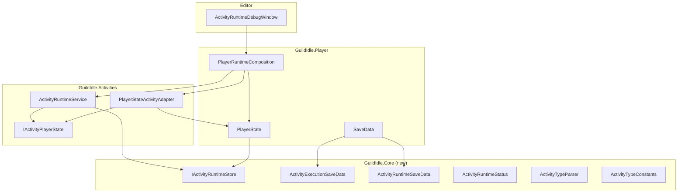

# План доработок Issue #18 — Follow-up

**Namespace:** `GuildIdle.Core`
**Parser:** enum + `TryParse` возвращает enum
**HeroStatsService:** удалить `CalculateMaxFatigue` (Вариант A)
**Composition:** отдельный класс

---

## Проблема 1 (🔴): Циклическая зависимость Activities ↔ PlayerState

### Текущее состояние
- `ActivityRuntimeService` хранит `PlayerState` напрямую и сам создаёт `PlayerStateActivityAdapter`
- `PlayerStateActivityAdapter` в `GuildIdle.Activities` импортирует `GuildIdle.Player`
- `PlayerState` (в `GuildIdle.Player`) импортирует `GuildIdle.Activities` для `ActivityExecutionSaveData`
- `SaveData.cs` (в `GuildIdle.Player`) содержит `ActivityExecutionSaveData` и `ActivityRuntimeSaveData`

### Решение

#### 1a. Создать `GuildIdle.Core` с типами данных

Перенести из `GuildIdle.Player.SaveData`:
- `ActivityExecutionSaveData`
- `ActivityRuntimeSaveData`

Перенести из `GuildIdle.Activities.ActivityRuntimeTypes`:
- `ActivityRuntimeStatus`

Новые типы:
- `IActivityRuntimeStore` — интерфейс для execution-операций

```csharp
namespace GuildIdle.Core
{
    public enum ActivityRuntimeStatus { None, Running, Completed, Cancelled }

    [Serializable]
    public sealed class ActivityExecutionSaveData { ... }

    [Serializable]
    public sealed class ActivityRuntimeSaveData { ... }

    public interface IActivityRuntimeStore
    {
        ActivityExecutionSaveData[] GetActivityExecutions();
        ActivityExecutionSaveData GetActivityExecution(string executionId);
        bool AddActivityExecution(ActivityExecutionSaveData execution);
        bool UpdateActivityExecution(ActivityExecutionSaveData execution);
        bool RemoveActivityExecution(string executionId);
        bool SaveActivityRuntime();
    }
}
```

#### 1b. Обновить `PlayerState`

- `PlayerState` реализует `IActivityRuntimeStore`
- Заменить `using GuildIdle.Activities` на `using GuildIdle.Core`
- `_activityExecutions` хранит `GuildIdle.Core.ActivityExecutionSaveData`

#### 1c. Обновить `SaveData`

- `SaveData` использует `GuildIdle.Core.ActivityExecutionSaveData` и `GuildIdle.Core.ActivityRuntimeSaveData`
- Удалить `using GuildIdle.Activities`

#### 1d. Обновить `ActivityRuntimeService`

- Конструктор: `ActivityRuntimeService(IActivityRuntimeStore store, IActivityPlayerState activityState, ISaveStorage storage = null)`
- Удалить поле `_state`, использовать `_store`
- Удалить создание `PlayerStateActivityAdapter` — получает готовый `IActivityPlayerState`
- Все execution-методы делегируют в `_store`

#### 1e. Создать composition-класс

```csharp
// Assets/Scripts/Player/PlayerRuntimeComposition.cs
namespace GuildIdle.Player
{
    public static class PlayerRuntimeComposition
    {
        public static ActivityRuntimeService CreateRuntimeService(ISaveStorage storage = null)
        {
            var state = Player.State;
            return new ActivityRuntimeService(
                state,
                new PlayerStateActivityAdapter(state),
                storage);
        }
    }
}
```

#### 1f. Обновить `ActivityRuntimeDebugWindow`

- Использовать `PlayerRuntimeComposition.CreateRuntimeService()` вместо `new ActivityRuntimeService(RuntimePlayer.State)`

### Диаграмма зависимостей (после)



## Проблема 2 (🔴): Унификация строковых типов не завершена

### Текущее состояние
- `ActivityTypeConstants` — `internal`, недоступен из Editor-сборки
- `ConfigCrossConfigValidator` использует регистрозависимые `switch` с `"BuildingUnlock"`, `"MapAccess"`
- Runtime использует `"Building"`, `"Location"` — несоответствие с validator
- `LootResolver` использует строковые литералы `"GuaranteedAll"`, `"WeightedOne"`, `"WeightedMany"`
- Неизвестный `dropType` молча принимается

### Решение

#### 2a. Перенести `ActivityTypeConstants` в `GuildIdle.Core`, сделать `public`

Добавить enum'ы:
```csharp
public enum RequirementTypeEnum { SkillLevel, LocationUnlocked, BuildingLevel, Building, ItemCount, Item, Currency, ActivityCompleted, HeroAvailable, ItemEquipped }
public enum RewardTypeEnum { Resource, Item, Equipment, Consumable, Recipe, SkillExp, Currency, Gold, Hero, Building, Location, LootTable }
public enum DropTypeEnum { Resource, Item, Equipment, Consumable, Recipe, Currency, Gold }
public enum TriggerTypeEnum { ActivityCompleted, BuildingLevel, HeroAvailable, LocationUnlocked, ItemCount }
public enum GrantMomentEnum { OnStart, OnCycle, OnComplete, OnFirstComplete }
public enum LootRollModeEnum { GuaranteedAll, WeightedOne, WeightedMany }
```

#### 2b. Создать `ActivityTypeParser` в `GuildIdle.Core`

```csharp
public static class ActivityTypeParser
{
    public static bool TryParseRequirementType(string value, out RequirementTypeEnum type);
    public static bool TryParseRewardType(string value, out RewardTypeEnum type);
    public static bool TryParseDropType(string value, out DropTypeEnum type);
    public static bool TryParseGrantMoment(string value, out GrantMomentEnum moment);
    public static bool TryParseLootRollMode(string value, out LootRollModeEnum mode);
    
    // Маппинг для обратной совместимости validator → runtime
    public static bool TryParseRewardTypeLegacy(string value, out RewardTypeEnum type);
}
```

`TryParseRewardTypeLegacy` маппит:
- `"BuildingUnlock"`, `"UnlockBuilding"` → `RewardTypeEnum.Building`
- `"MapAccess"`, `"UnlockLocation"` → `RewardTypeEnum.Location`
- Всё остальное → обычный `TryParseRewardType`

#### 2c. Обновить `ConfigCrossConfigValidator`

- Заменить `switch` на `TryParseRewardTypeLegacy` + `TryParseDropType`
- Неизвестный тип → ошибка валидации (вместо молчаливого пропуска)

#### 2d. Обновить runtime-резолверы

- Заменить `RewardType.Matches(...)` на `TryParseRewardType` + enum switch
- Заменить `DropType.Matches(...)` на `TryParseDropType` + enum switch
- Заменить `RequirementType.Matches(...)` на `TryParseRequirementType` + enum switch
- Заменить `"GuaranteedAll"` и т.д. на `TryParseLootRollMode` + enum switch

## Проблема 3 (🟠): Тест lifecycle не проверяет реальный сценарий

### Решение

#### 3a. Сделать `Bootstrap` и `HandleConfigLoadFailed` `internal`

В `Player.cs`:
```csharp
internal static void Bootstrap() { ... }
internal static void HandleConfigLoadFailed(string error) { ... }
```

#### 3b. Добавить тест `Bootstrap_DoesNotDoubleLoad_AfterConfigReload`

```csharp
[Test]
public void Bootstrap_DoesNotDoubleLoad_AfterConfigReload()
{
    // Bootstrap подписывается на OnLoaded
    Player.Bootstrap();
    
    // Симулируем OnLoaded → LoadAfterConfigs
    Player.LoadAfterConfigs();
    Assert.That(Player.IsLoaded, Is.True);
    Assert.That(Player.AddItem("resource_pine_wood", 5), Is.True);
    
    // Симулируем OnLoadFailed
    Player.HandleConfigLoadFailed("test error");
    Assert.That(Player.IsLoaded, Is.False);
    
    // Симулируем Configs.Reload → OnLoaded
    Player.LoadAfterConfigs();
    Assert.That(Player.IsLoaded, Is.True);
    
    // После reload состояние свежее — предмета нет
    Assert.That(Player.GetItem("resource_pine_wood"), Is.EqualTo(0));
}
```

#### 3c. Добавить тест `Bootstrap_SubscribesOnce_AfterConfigFailThenReload`

```csharp
[Test]
public void Bootstrap_SubscribesOnce_AfterConfigFailThenReload()
{
    Player.Bootstrap();
    Player.LoadAfterConfigs();
    Assert.That(Player.AddItem("resource_pine_wood", 3), Is.True);
    
    // Второй OnLoaded — guard не даёт перезагрузить
    Player.LoadAfterConfigs();
    Assert.That(Player.GetItem("resource_pine_wood"), Is.EqualTo(3));
}
```

## Проблема 4 (🟠): HeroStatsService — незавершённое дублирование

### Решение
Удалить `HeroStatsService.CalculateMaxFatigue`. Оставить только `ResolveSkillLevel`.

```csharp
public static class HeroStatsService
{
    public static int ResolveSkillLevel(long exp)
    {
        // существующая логика
    }
    
    // TODO: Вынести CalculateHeroMaxFatigue из PlayerState с сохранением точной логики
    // public static int CalculateMaxFatigue(string heroId, int level, FormulasConfigRepository formulas, HeroesConfigRepository heroes) { ... }
}
```

## Проблема 5 (🟡): Debug Window — stale state после Reset/Reload

### Решение
Добавить поле `_boundState` и проверку `ReferenceEquals`:

```csharp
private ActivityRuntimeService _runtime;
private PlayerState _boundState;

private bool CanUseRuntime()
{
    if (!Application.isPlaying || !RuntimeConfigs.IsLoaded || !RuntimePlayer.IsLoaded)
        return false;

    if (_runtime == null || !ReferenceEquals(_boundState, RuntimePlayer.State))
    {
        _runtime = PlayerRuntimeComposition.CreateRuntimeService();
        _boundState = RuntimePlayer.State;
    }

    return true;
}
```

## Порядок выполнения

| № | Проблема | Сложность | Файлы |
|---|----------|-----------|-------|
| 1 | 🟠 HeroStatsService — удалить CalculateMaxFatigue | Низкая | `HeroStatsService.cs` |
| 2 | 🟡 Debug Window — stale state | Низкая | `ActivityRuntimeDebugWindow.cs` |
| 3 | 🟠 Тест lifecycle — реальный сценарий | Низкая | `PlayerLifecycleTests.cs`, `Player.cs` |
| 4 | 🔴 Унификация типов — ActivityTypeParser | Средняя | `ActivityTypeConstants.cs` → `GuildIdle.Core`, новый `ActivityTypeParser.cs`, `ConfigCrossConfigValidator.cs`, все резолверы |
| 5 | 🔴 IActivityRuntimeStore — разрыв цикла | Высокая | Новый `GuildIdle.Core`, `ActivityRuntimeService.cs`, `PlayerState.cs`, `SaveData.cs`, `PlayerRuntimeComposition.cs`, `ActivityPlayerState.cs` |